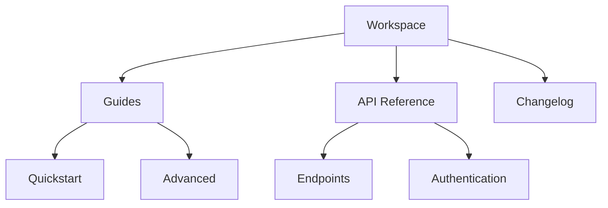

## Overview

R provides powerful tools to organize, edit, and collaborate on your documentation. You create structured spaces for projects, track changes efficiently, and share content with teams seamlessly. These core features ensure your docs stay current and accessible.

<Columns cols={3}>
  <Card title="Document Organization" icon="folder" href="/docs/organization">
    Build hierarchies with folders and pages to keep content structured.
  </Card>
  <Card title="Version History" icon="git-branch" href="/docs/versions">
    Track edits, revert changes, and maintain history effortlessly.
  </Card>
  <Card title="Collaboration" icon="users" href="/docs/collaboration">
    Invite team members and share docs securely.
  </Card>
</Columns>

## Document Organization and Hierarchy

You organize documentation using nested folders and pages, creating intuitive hierarchies. Start with a root workspace, add folders for sections like `guides/`, `api/`, and `changelog/`, then nest pages inside.



<Steps>
  <Step title="Create Workspace" icon="folder-plus">
    Log in and select **New Workspace** to start your documentation space.
  </Step>
  <Step title="Add Folders" icon="plus">
    Right-click the root and choose **New Folder**. Name it `api/` for endpoints.
  </Step>
  <Step title="Nest Pages" icon="file-text">
    Inside folders, create MDX pages. Use frontmatter for metadata.
  </Step>
</Steps>

<Callout kind="tip">
  Use consistent naming like `kebab-case` for folders to improve navigation.
</Callout>

## Version History and Editing Tools

R tracks every edit automatically, letting you view diffs, revert changes, and compare versions. The visual editor supports Markdown, MDX components, and live previews.

<Tabs>
  <Tab title="Visual Editor" icon="edit-3">
    Drag-and-drop components like `<Callout>` or `<Steps>`. Preview renders instantly.
  </Tab>
  <Tab title="Source Editor" icon="code">
    Edit raw MDX. Syntax highlighting supports JavaScript, JSON, and more.
  </Tab>
</Tabs>

View history via the page menu. Select a version to restore or download.

```javascript
// Example: Fetch version history via API
const versions = await fetch('/api/pages/my-page/versions');
console.log(versions); // Array of {id, date, author, changes}
```

## Collaboration and Sharing Options

Invite users by email or link. Set permissions: view, edit, or admin.

| Role       | View | Edit | Delete | Share |
|------------|------|------|--------|-------|
| Viewer     | ✅   | ❌   | ❌     | ❌    |
| Editor     | ✅   | ✅   | ❌     | ✅    |
| Admin      | ✅   | ✅   | ✅     | ✅    |

<CodeGroup tabs="JavaScript,cURL">
  ```javascript
  // Invite collaborator
  await fetch('/api/workspaces/{workspaceId}/invites', {
    method: 'POST',
    body: JSON.stringify({email: 'user@example.com', role: 'editor'})
  });
  ```
  ```bash
  curl -X POST https://api.r-docs.com/workspaces/{workspaceId}/invites \\
    -H "Authorization: Bearer YOUR_TOKEN" \\
    -d '{"email": "user@example.com", "role": "editor"}'
  ```
</CodeGroup>

<Expandable title="Advanced Sharing" default-open="false">
  Generate public links for read-only access. Embed pages via iframe on external sites.

  <Image
    src="https://example.com/embed-preview.png"
    alt="Embedded documentation preview"
    width="800"
    height="400"
  />
</Expandable>

These features empower you to build scalable documentation workflows. Explore each in depth through the linked guides.