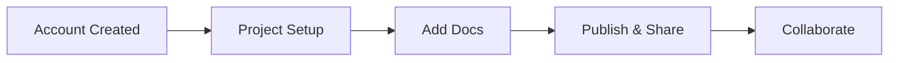

## Quickstart Overview

Get started with R in minutes. Follow these steps to create your account, set up a new project space, and explore the interface. R provides an intuitive platform for organizing project documentation with real-time previews and collaborative editing.

<Callout kind="tip">
  Use your brand color `#3B82F6` in themes for a customized look.
</Callout>

## Create Your Account

Sign up for R to access unlimited project spaces and documentation tools.

<Tabs>
  <Tab title="Email" icon="mail">
    Visit [r-docs.com/signup](https://r-docs.com/signup) and enter your email address.
    
    1. Provide your name and password.
    2. Verify your email via the confirmation link.
    
    <Image
      src="https://example.com/signup-email.png"
      alt="Email signup form in R"
      width="600"
      height="400"
    />
  </Tab>
  <Tab title="Google" icon="apple">
    Click the Google button on the signup page.
    
    Grant permissions for seamless authentication.
    
    No password required—secure and fast.
  </Tab>
</Tabs>

## Set Up a New Project Space

Once logged in, create your first documentation project.

<Steps>
  <Step title="Dashboard Access" icon="home">
    From the dashboard, click **New Project**.
    
    Name it `My Project Docs` and select a template like "Default".
  </Step>
  <Step title="Configure Settings" icon="settings">
    Set your project slug to `my-project`.
    
    Enable features like search and versioning.
    
    ```

    yaml
    title: My Project Docs
    description: Documentation for my awesome project
    themeColor: "#3B82F6"
    ```
  </Step>
  <Step title="Add First Page" icon="plus">
    Create `index.mdx` with basic content.
    
    <CodeGroup tabs="MDX,Bash">
      ```mdx
      # Welcome to My Project
      
      Start documenting here.
      ```
      ```bash
      r-docs init my-project
      cd my-project
      r-docs serve
      ```
    </CodeGroup>
  </Step>
</Steps>

## Basic Navigation and Interface Tour

R's interface includes a sidebar for pages, a central editor, and a live preview pane.

<Columns cols={3}>
  <Card title="Sidebar" icon="layout" href="/docs/sidebar">
    Manage pages, folders, and settings.
  </Card>
  <Card title="Editor" icon="edit-3" href="/docs/editor">
    Write in MDX with syntax highlighting.
  </Card>
  <Card title="Preview" icon="eye" href="/docs/preview">
    Real-time rendering with components.
  </Card>
</Columns>

<Expandable title="Advanced Navigation Tips" default-open="false">

Use keyboard shortcuts like `Cmd+K` for quick search.

- **Global search**: Find across all pages.
- **Version history**: Track changes.
- **Collaboration**: Invite team members.

</Expandable>

<Callout kind="success">
  Congratulations! Your first project is live at `https://r-docs.com/my-project`.
</Callout>

## Next Steps

Explore integrations and advanced features.



Your documentation space is ready. Publish changes with `r-docs deploy` for instant updates.