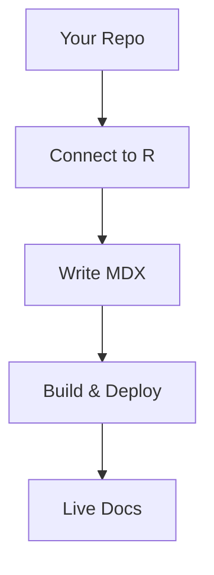

## Overview

R provides a centralized space for you to organize, create, and manage all your project documentation. You can build comprehensive guides, API references, and changelogs with powerful MDX components that render interactive elements like tabs, steps, and code examples. Start by connecting your repository, and R handles versioning, search, and deployment automatically.

<Callout kind="info">
  R supports unlimited pages and custom domains. Upgrade for advanced analytics and private spaces.
</Callout>

## Key Benefits

R streamlines your documentation workflow with these core advantages:

<Columns cols={3}>
  <Card title="Fast Setup" icon="zap" href="/docs/quickstart">
    Connect your GitHub repo in under 2 minutes and publish instantly.
  </Card>
  <Card title="Interactive Docs" icon="code" href="/docs/components">
    Use components like `<Steps>` and `<Tabs>` for engaging, user-friendly content.
  </Card>
  <Card title="Version Control" icon="git-branch" href="/docs/versioning">
    Automatic versioning tied to your repo branches keeps docs always up-to-date.
  </Card>
</Columns>

## Common Use Cases

You can use R for various documentation needs across platforms and languages.

<Tabs>
  <Tab title="API Documentation" icon="api">
    Document endpoints with `<Request>` and `<Response>` components.

    <CodeGroup tabs="JavaScript,Python">
    ```javascript
    const response = await fetch('https://api.example.com/users', {
      method: 'POST',
      headers: { 'Authorization': 'Bearer YOUR_TOKEN' },
      body: JSON.stringify({ name: 'John Doe' })
    });
    ```
    ```python
    import requests
    response = requests.post(
      'https://api.example.com/users',
      headers={'Authorization': 'Bearer YOUR_TOKEN'},
      json={'name': 'John Doe'}
    )
    ```
    </CodeGroup>
  </Tab>
  <Tab title="User Guides" icon="book-open">
    Create step-by-step tutorials for onboarding new users.
  </Tab>
  <Tab title="Changelogs" icon="git-commit">
    Track releases with `<Update>` components for clear history.
  </Tab>
</Tabs>

## Quick Start

Follow these steps to set up your first documentation site:

<Steps>
  <Step title="Connect Repository" icon="git-pull-request">
    Link your GitHub repo via the dashboard.
  </Step>
  <Step title="Create Pages" icon="file-plus">
    Add MDX files like `introduction.mdx` in your `docs/` folder.
  </Step>
  <Step title="Customize" icon="settings">
    Edit frontmatter and use components for rich layouts.

    ```bash
    npm install r-docs --save-dev
    npx r-docs build
    ```
  </Step>
  <Step title="Deploy" icon="rocket">
    Push changes to see live updates.
  </Step>
</Steps>

## Brand Guidelines

Adhere to R's branding for consistency:

- **Primary Color:** `#3B82F6`
- **Typography:** Use system fonts for best performance
- **Icons:** Lucide library (e.g., `zap`, `shield`)

<Callout kind="tip" default-open="true">
  Download the brand kit from your dashboard for logos and assets.
</Callout>

## Support Resources

<ExpandableGroup>
  <Expandable title="Community Forum" default-open="true">
    Join discussions on common setups and troubleshooting.
  </Expandable>
  <Expandable title="Advanced Customization">
    Explore custom themes and CI/CD integrations.
  </Expandable>
</ExpandableGroup>



This setup ensures your documentation scales with your project. Explore the sidebar for detailed guides.